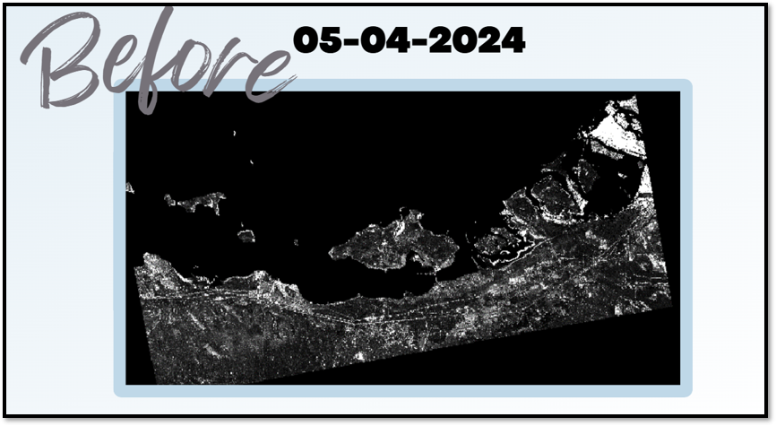
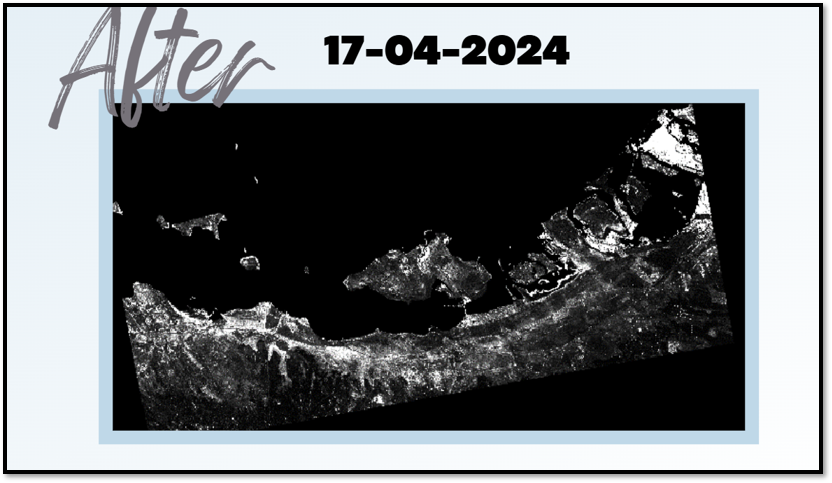
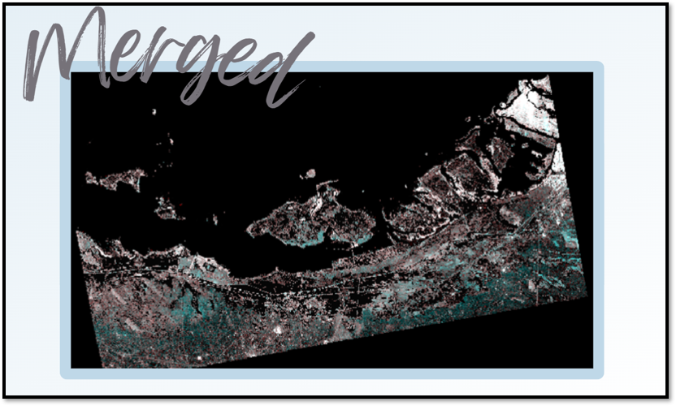
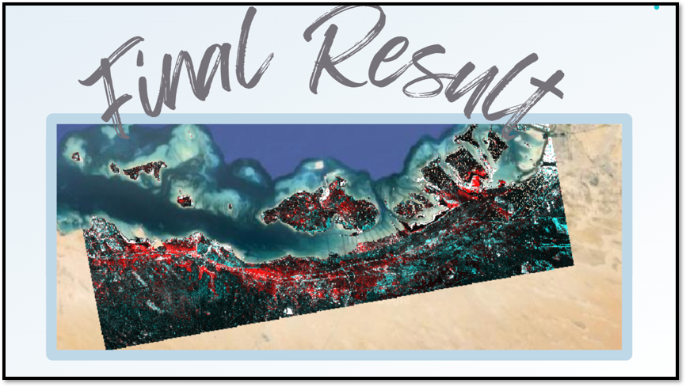

# Flood Detection Using Sentinel-1 SAR Data  
**Preprocessing in ESA SNAP • Visualization in QGIS**

This project demonstrates how Synthetic Aperture Radar (SAR) imagery from Sentinel-1 can be used to detect and map flood-affected areas. Using ESA's SNAP for preprocessing and QGIS for final visualization, we compare SAR data before and after a flood to identify water-covered regions with precision.

---

## 🌍 Objective

To detect and visualize flooded areas using satellite SAR data by applying a consistent and reproducible geospatial workflow. The final output clearly shows flood extent, with flooded areas visually highlighted.

---

## 🛠️ Tools & Technologies

### 1. **[ESA SNAP](http://step.esa.int/main/toolboxes/snap/)**  
Used for SAR image preprocessing and analysis.

- Radiometric Calibration
- Speckle Filtering
- Terrain Correction (using SRTM DEM)
- Band Math for image differencing
- Image subsetting (optional)
- Export as GeoTIFF

### 2. **[QGIS](https://qgis.org/)**  
Used for map styling, analysis, and layout design.

- Layer visualization (before/after flood)
- Raster Calculator (change detection)
- Symbol styling (flood zones in red)
- Merged image generation
- Map layout for final output

---

## 🛰️ Step-by-Step Workflow

### Step 1: Acquire SAR Data
- Download Sentinel-1 GRD (Ground Range Detected) products from [Copernicus Open Access Hub](https://scihub.copernicus.eu/).

### Step 2: Preprocess SAR Images in SNAP
Process both *pre-flood* and *post-flood* images using the following chain:

1. **Radiometric Calibration**  
   Converts digital numbers to calibrated backscatter values.

2. **Speckle Filtering**  
   Apply a filter (e.g., Lee, Gamma) to reduce SAR noise.

3. **Terrain Correction**  
   Georeference the image using a DEM (e.g., SRTM 1Sec HGT).

4. **Subsetting (Optional)**  
   Crop the area of interest to speed up processing and focus analysis.

5. **Export**  
   Export each processed image as GeoTIFF for use in QGIS.

### Step 3: Analyze in QGIS

1. **Load the GeoTIFFs**  
   Import both pre- and post-flood images into QGIS.

2. **Use Raster Calculator**  
   Subtract the post-flood image from the pre-flood image to highlight changes.

3. **Style the Output**  
   Apply a color ramp or threshold logic to show flooded areas in red.

4. **Merge Layers**  
   Overlay before, after, and flood detection results for better comparison.

5. **Generate Final Map**  
   Use QGIS's Print Layout tool to create a professional map with scale bar, legend, and title.

---

## 🖼️ Visual Results

### 📌 Before the Flood  

### 📌 After the Flood  

### 📌 Merged Comparison  

### 📌 Final Flood Detection  

---

## 🔍 Key Insights

- SAR is ideal for flood detection due to its ability to penetrate clouds and collect data in any weather or lighting.
- Changes in backscatter values clearly differentiate water surfaces.
- A combined QGIS-SNAP workflow is both open-source and highly effective.

---

## 📌 Applications

- Emergency response & flood risk management
- Environmental monitoring
- Infrastructure and agriculture planning

---

## 🧑‍💻 Author

**Meirah Ali Alzeyoudi**  
Product Engineer | Space & Geospatial Researcher  
_“Advancing environmental insights through satellite technology.”_

